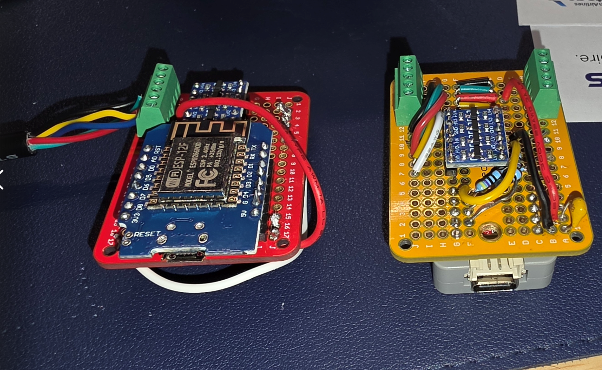
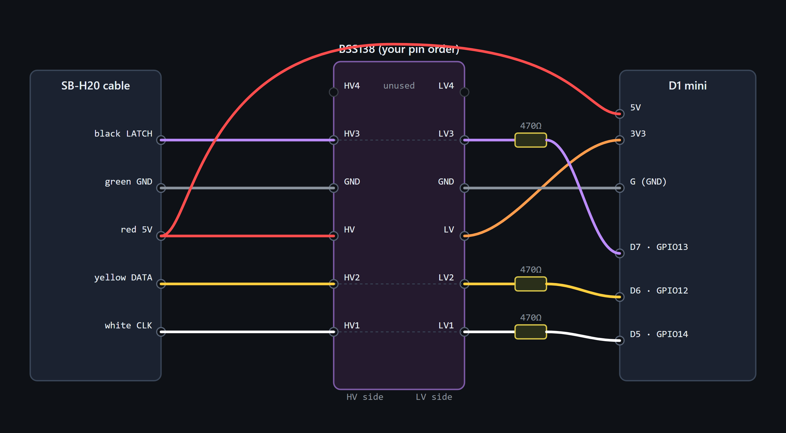
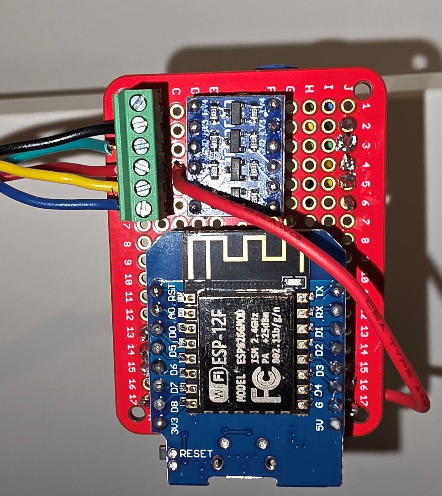

# Intex PureSpa SB-H20 → ESPHome (ESP32 or ESP8266)

WiFi + Home Assistant control for the **Intex PureSpa** with the **SB-H20** control
panel (the older, non-WiFi pump), via a **BSS138 level shifter** tapping the ribbon
between the control panel and the mainboard — no board replacement, no soldering on
the spa itself.

> **Tested on:** Intex **28431E PureSpa Plus** (SB-H20 panel). The SB-H20 plug/pinout
> is shared with the SSP and SJB models, so this should also apply to SimpleSpa SB-B20,
> SSP-H-20-1, and SJB-HS.

## Two build options

The SB-H20 button protocol is timing-critical (the panel pulls DATA low for ~2&nbsp;µs
windows). How well a board hits that timing while running WiFi is the whole story:

| | **ESP32 / M5Stack Atom Lite** ⭐ recommended | **ESP8266 / Wemos D1 mini** |
|---|---|---|
| Button timing | ISRs pinned to **core 1**, WiFi on core 0 → can't be preempted | single core — WiFi can disrupt the 2&nbsp;µs pulse (occasional missed presses) |
| CPU tweak | none | must force **160&nbsp;MHz** |
| Boot quirk | none on G19/22/23 | needs **470&nbsp;Ω** series resistors to boot with cables attached |
| Measured power | ~66&nbsp;mA / ~120&nbsp;mA peak | ~20–100&nbsp;mA |
| Component | this repo's `intexsbh20` (ESP32 port of piitaya) | [`piitaya/esphome-intexsbh20`](https://github.com/piitaya/esphome-intexsbh20) |
| Guide | **→ [esp32-atom/](esp32-atom/)** | this page (below) |

**Use the ESP32 / Atom Lite build** unless you specifically want the ESP8266 — the
second core solves the timing-reliability problem that makes button presses flaky on
the '8266. Both share the same BSS138 wiring and the same spa-side tap; only the
controller and a couple of details differ. (The Raspberry Pi Pico W is a third option
— [`RealByron/PicoW-Intex-PureSpa`](https://github.com/RealByron/PicoW-Intex-PureSpa)
— which offloads timing to PIO.)

*Left: ESP8266 / Wemos D1 mini. Right: ESP32 / M5Stack Atom Lite (BSS138 + 470&nbsp;Ω + screw terminals on an ElectroCookie Mini).*

### → ESP32 build (recommended): [esp32-atom/README.md](esp32-atom/README.md)

The rest of this page is the **ESP8266 / Wemos D1 mini** build.

---

> Open `wiring/sbh20-wiring.html` in a browser for the same diagram interactively.

---

## Bill of materials (ESP8266 / D1 mini build)

| Part | Notes |
|------|-------|
| Wemos / LOLIN **D1 mini** (ESP8266) | ESP12/HUZZAH also work |
| **BSS138** 4-channel level shifter | *not* TXS0108E — auto-direction chips fight the open-drain DATA line |
| 3 × **470 Ω** resistors | series on each signal line (see gotcha #4) |
| **Inline fuse, ~250–500 mA** | on the 5 V tap — protects the spa mainboard (see gotcha #6) |
| Cable tap / 3D-printed connector | to splice the panel↔mainboard ribbon |
| Hookup wire, perfboard, IP-rated box | permanent outdoor install |

Total ≈ $8–15. Power draw is tiny: ~20 mA idle, ~70 mA on WiFi, ~100 mA at power-on —
size the fuse just above the inrush.

### Parts used on this build (tested)

These are the exact multi-packs used for the unit pictured above (links are not
affiliate links — substitute equivalents freely):

| Part | Product |
|------|---------|
| D1 mini (ESP8266, ESP-12F) — 5 pk | Hosyond D1 Mini NodeMcu — https://www.amazon.com/dp/B09SPYY61L |
| BSS138 4-ch level shifter — 10 pk | HiLetgo 4-Channel I2C Bi-Directional — https://www.amazon.com/dp/B07F7W91LC |
| Solderable proto board — 6 pk | ElectroCookie Mini PCB Prototype Board — https://www.amazon.com/dp/B081MSKJJX |
| IP68 outdoor enclosure | MAKERELE Small External Junction Box — https://www.amazon.com/dp/B0D3GR7CWB |

Still need separately: a small screw-terminal block (used here to land the spa cable),
3 × 470 Ω resistors, hookup wire, and a way to tap the panel ribbon.

---

## Wiring (as-built)

**Spa cable colors vary by production batch — verify yours with a meter.** On this
unit the colors were:

| Spa wire | Function | BSS138 | Series R | D1 mini |
|----------|----------|--------|----------|---------|
| red    | +5 V  | HV  | —     | 5V pin |
| green  | GND   | GND | —     | G |
| white  | CLK   | HV1 ↔ LV1 | **470 Ω** | D5 / GPIO14 |
| yellow | DATA  | HV2 ↔ LV2 | **470 Ω** | D6 / GPIO12 |
| black  | LATCH | HV3 ↔ LV3 | **470 Ω** | D7 / GPIO13 |

- BSS138 **HV ← red 5 V**, **LV ← D1 mini 3V3** (both references required).
- All grounds common (spa green ↔ BSS138 GND ↔ D1 mini G).
- The D1 mini is powered **from the spa's 5 V** (red) in normal use.

### Identifying the wires with a multimeter (DC, spa on, ref = GND)

| Reading | Meaning |
|---------|---------|
| steady 5 V | the **supply** (only one wire) |
| 0 V steady + continuity to chassis | **GND** |
| ~2.5 V (50 % duty avg) | **CLK** (free-running clock) |
| ~3 V (mostly high, active) | **DATA** (open-drain, idle high) |
| ~4.5–5 V (idle high, brief pulses) | **LATCH** (per-frame strobe) |

Multiple wires can read ~5 V — those are idle-high signals, not power. The real
supply is the one that's *dead steady*.

---

## Gotchas (the stuff that actually bit us)

1. **Wire colors are not standard.** red≠5V on every unit. Measure. The supply is
   whichever wire is a rock-steady ~5 V; idle-high signals also read ~5 V.
2. **CPU must be 160 MHz.** Reads work at 80 MHz but button TX silently fails.
   Set `board_build.f_cpu: 160000000L` and **Clean Build** (the flag often doesn't
   apply on an incremental build). Verify at runtime with `ESP.getCpuFreqMHz()`.
3. **Use BSS138, not TXS0108E.** The DATA line is open-drain with a pull-up; the
   TXS0108E's auto-direction sensing fights it. BSS138 is purpose-built for this.
4. **470 Ω series resistors on the signal lines.** Without them the ESP8266 may
   **fail to boot with the cables connected** — the 5 V signals back-power the chip
   through the level shifter / GPIO clamp diodes before the rail is up. The resistors
   limit that injection. (Also keep signals on D5/D6/D7 — never the D3/D4/D8 strap pins.)
5. **Never power USB + spa at the same time.** Flash on USB, then run on spa 5 V only.
   Future updates go over **OTA**.
6. **Fuse the 5 V tap (~250–500 mA).** The spa mainboard's spare current budget is
   unknown — a fault in your add-on could damage it. An inline fuse just above the
   ~100 mA power-on inrush protects the board. *(via jnsbyr's hardware notes.)*
7. **Button presses can be occasionally unreliable.** On the ESP8266, WiFi processing
   preempts the timing-critical signalling, so a press is sometimes missed or doubled.
   Keep WiFi signal strong (RSSI) and expect the rare retry. The underlying firmware
   re-reads state after each press to self-correct. This is inherent to ESP8266 — the
   Pico W version avoids it with PIO.

---

## Flashing

1. Copy `esphome/secrets.yaml.example` → `secrets.yaml` and fill in WiFi + a generated
   `api_key` / `ota_password`.
2. First flash over USB (D1 mini only, **not** wired to the spa). Then OTA forever after.
3. Wire to the spa per the table, power from spa 5 V, confirm the `water_temperature`
   entity reads correctly and a button (Power/Bubble) activates.

`esphome/intex-spa.diagnostic.yaml` is a throwaway firmware that turns the three GPIOs
into frequency counters — handy for identifying CLK (highest edge rate) when sorting
the signal wires.

`tools/esp_log_monitor.py` streams the device's logs over the native API from a PC
(no ESPHome CLI needed) — set the address + noise PSK at the top.

---

## Credits

- [`piitaya/esphome-intexsbh20`](https://github.com/piitaya/esphome-intexsbh20) — the ESPHome component
- [`jnsbyr/esp8266-intexsbh20`](https://github.com/jnsbyr/esp8266-intexsbh20) — protocol reverse engineering
- [`RealByron/PicoW-Intex-PureSpa`](https://github.com/RealByron/PicoW-Intex-PureSpa) — Pico W variant

## License

MIT — see [LICENSE](LICENSE).
