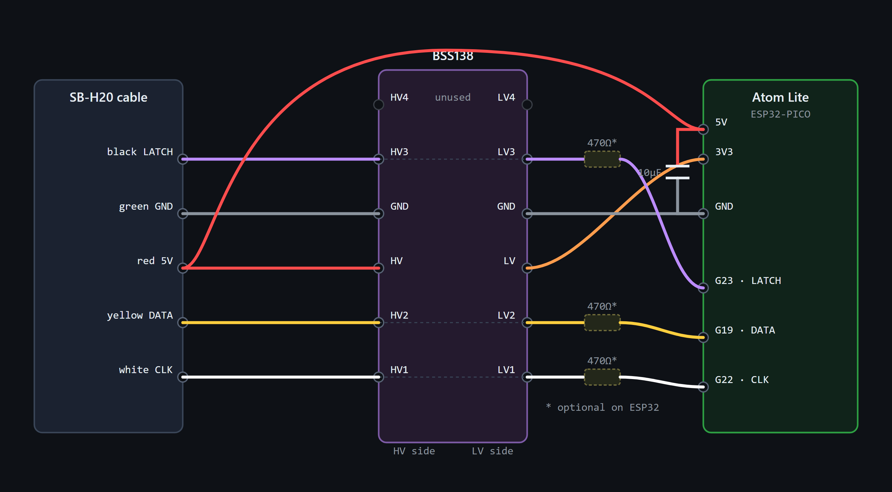

# ESP32 (M5Stack Atom Lite) port

An ESP32 port of the `intexsbh20` ESPHome component, targeting the **M5Stack Atom
Lite** (ESP32-PICO-D4). The upstream components are ESP8266 (`piitaya`) or
RP2040/Pico W (`RealByron`) only — this is an ESP32-native firmware for the SB-H20
panel.

> ✅ **Status: working — validated on a real Intex 28431E PureSpa Plus (SB-H20).**
> Water temperature reads correctly and every control works from Home Assistant:
> Power, Heater, Bubble, Filter, and temperature Up/Down (setpoint read **and** change).

> Open `wiring/atom-wiring.html` for the same diagram interactively.

## Why ESP32 here

The SB-H20 is a continuous, latch-framed serial bus (~16-bit frames). Reading it reliably
*while* running WiFi is the whole challenge. On the **ESP8266** a single core runs WiFi and
the capture, so WiFi preempts the timing and button presses get missed — the well-known
reliability issue.

The **ESP32 has two cores.** This port pins all bus capture to **core 1 (APP_CPU)** while
ESPHome's WiFi runs on **core 0 (PRO_CPU)**, so WiFi can't disturb the receive/transmit
timing — the same isolation the Pico W gets from PIO, on a cheaper, tinier, 5 V-friendly
board.

## How it works (capture architecture)

1. **Auto-detects which pin is the clock.** At boot a core-1 task briefly measures both
   signal pins; the clock has far more edges than data, so the **clock/data wiring order
   doesn't matter** — only LATCH is fixed.
2. **Interrupt-driven capture.** It then installs GPIO interrupts (clock-rising +
   latch-falling) on core 1, exactly like the proven D1-mini build. A hardware interrupt
   latches every clock edge regardless of CPU load, and releases the DATA line precisely
   after a button reply — so transmitting a press never corrupts the frames being received.
3. **Light decode in the ISR, heavy decode deferred.** LED/button frames decode in the
   ISR; the 7-segment display decode runs in the main loop. Frames that don't form a
   plausible value (a temperature, a blank, an error, or a valid LED word) are rejected,
   which shrugs off the small amount of residual line noise.

## Wiring (Atom Lite)

All three signals must be on **GPIO < 32** (the fast path uses the 32-bit GPIO registers).

- **LATCH → G23** (the per-frame strobe: idle-high with brief low pulses — see the
  multimeter ID table in the [main README](../README.md)).
- **CLOCK and DATA → G19 and G22, in *either* order** — the firmware auto-detects them.

| Spa wire | Function | BSS138 | Atom Lite pin |
|----------|----------|--------|---------------|
| red\*    | +5 V  | HV  | **5V** |
| green\*  | GND   | GND | **GND** |
| signal   | CLK / DATA | HV1 ↔ LV1 | **G19** ┐ either order |
| signal   | DATA / CLK | HV2 ↔ LV2 | **G22** ┘ (auto-detected) |
| signal   | LATCH | HV3 ↔ LV3 | **G23** |

\* *Wire colors vary by production batch — identify by function with a meter, don't trust
the color. On the unit pictured, GND was green and +5 V was red; the three signal wires
were white/blue, yellow and black.*

- BSS138 **LV ← Atom 3V3**, **HV ← spa 5 V**. All grounds common.
- Power the Atom from spa **5 V** (its 5V pin); its onboard regulator makes 3V3.
- The ESP8266 build's **470 Ω series resistors are optional** here — G19/G22/G23 aren't
  ESP32 strapping pins, so the boot back-power issue doesn't occur. Harmless to keep.

`spa-atom.yaml` sets `clock_pin: 19`, `data_pin: 22`, `latch_pin: 23`. Because clock/data
auto-detect, you can swap the first two freely; just keep latch on `latch_pin`.

## Power

Measured on the bench (Atom Lite, WiFi connected, `output_power: 12dB` +
`power_save_mode: light`):

| State | Current @ 5 V |
|-------|---------------|
| Steady | **~66 mA** |
| WiFi TX peaks | **~110–120 mA** |

Light enough to run off the spa's 5 V tap with margin. **Fuse the 5 V line at ~250 mA
slow-blow** (≈2× the peak). A **10 µF** cap across the Atom 5V/GND smooths the TX spikes.

## Build / flash

1. Copy your `secrets.yaml` (wifi + api_key + ota_password) next to `spa-atom.yaml`.
2. `esphome run spa-atom.yaml` (first compile pulls the ESP32 toolchain).
3. Flash over USB-C, confirm WiFi + entities, then wire to the spa (5 V — **don't** power
   USB and the spa at the same time). Updates after that go over OTA.

**Build on your Home Assistant / ESPHome box**, where the platform installs cleanly. Two
Windows gotchas if you build there:
- An **accented character in the user path** (e.g. `C:\Users\José\…`) breaks the xtensa
  linker (it truncates the path). Build from an ASCII path / set `PLATFORMIO_CORE_DIR` to one.
- A flaky package mirror on first install can leave `framework-arduinoespressif32-libs` an
  empty stub (missing WiFi/PHY blobs → `cannot find -lcore/-lphy/...`). Re-run the platform
  install if you see that.

## What changed vs. the ESP8266 component

| Area | ESP8266 original | ESP32 port |
|------|------------------|------------|
| Pins | hard-coded GPIO 14/12/13 | YAML `clock_pin`/`data_pin`/`latch_pin`; **clock/data auto-detected** |
| GPIO access | `digitalRead()` | direct `GPIO_IN_REG` / `GPIO_ENABLE_W1TS/W1TC` |
| Capture core | the only core | GPIO ISRs installed from a task **pinned to core 1** |
| CPU clock | must force 160 MHz | n/a (240 MHz, core-isolated) |
| Setpoint read | blocking | **non-blocking** (a blocking read stalled the loop and dropped the HA API) |
| Framework | — | **`arduino`** required |

Receive decoding, frame parsing, button logic and the climate/switch/sensor entities are
otherwise the proven `piitaya/esphome-intexsbh20` logic.

## Build validation status

| Check | Result |
|-------|--------|
| Host unit tests (`test/test_decode.cpp`, decode math) | ✅ pass (g++) |
| `esphome config` (schema / pins / codegen) | ✅ valid |
| Compile on the ESP32 toolchain | ✅ zero errors |
| Flashable `firmware.bin` | ✅ builds + flashes (HA/ESPHome box) |
| **Runs on a real spa** | ✅ temp + all controls on an Intex 28431E PureSpa Plus |

## Notes / limitations

- Diagnostics log at **VERBOSE** level — set the logger to `VERBOSE` to see frame/decode
  stats; normal logs stay quiet.
- A *manually* toggled control still blocks the loop briefly while it waits for the panel's
  ack; if the device ever blips to "unavailable" right when you tap a control, that's why.
  The **automatic** setpoint read (which used to stall the loop every 30 s and drop the
  API) is non-blocking.
- `framework: arduino` is required (`attachInterruptArg`, `pinMode`, `REG_READ/WRITE`); an
  esp-idf variant would need rework.
- Pins are constrained to GPIO 0–31. The Atom exposes G19/21/22/23/25 (+ Grove G26/G32) —
  all fine.

## License

The `SBH20IO.*` receive code is derived from DIYSCIP and is licensed
**CC-BY-NC-SA-4.0** (non-commercial). The rest follows the upstream
`piitaya/esphome-intexsbh20`. See file headers.
